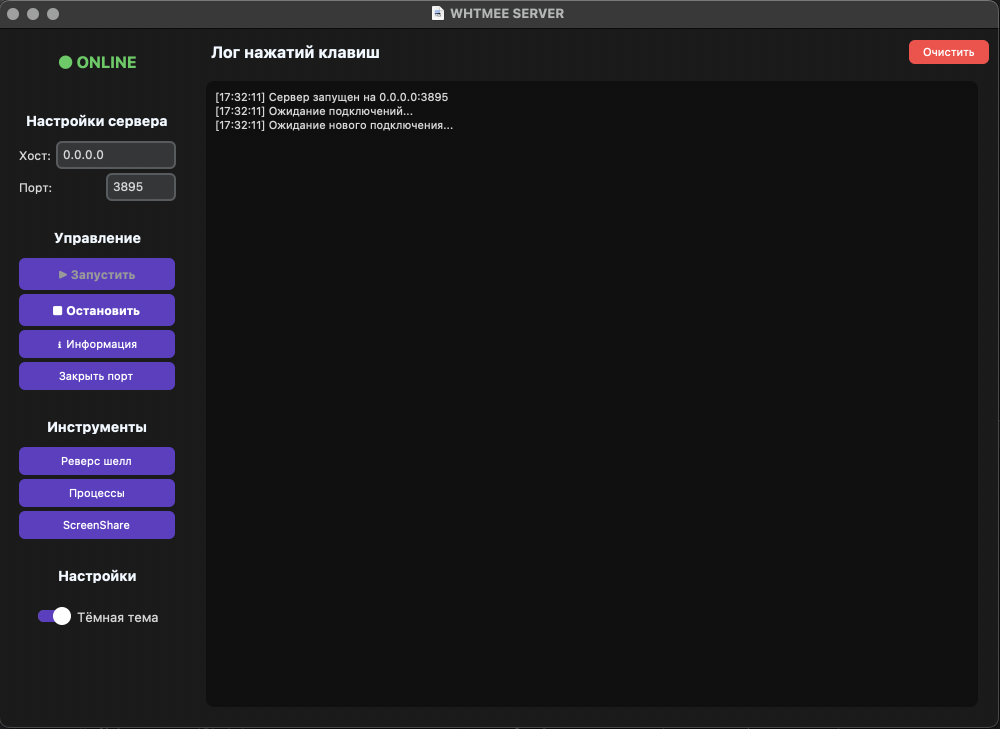

# WHTMEE RAT

## Интерфейс сервера



## Remote Access Tool для macOS с функциями кейлоггера, реверс-шелла и управления процессами.

## Описание

RAT (Remote Access Tool) - это клиент-серверное приложение для удаленного мониторинга и управления macOS системами. Программа включает в себя кейлоггер, реверс-шелл, управление процессами и функцию скриншейра (в разработке).

## Функциональность

### Серверная часть (server.py)
- GUI на CustomTkinter
- Keylogger
- Reverse-shell
- Управление процессами устройства клиента
- Загрузка файлов с устройства клиента
- Автоматическое переподключение клиентов
- Изменение тем интерфейса

### Клиентская часть (client.py)
- Скрытый режим работы
- Кейлоггер с буферизацией слов и предложений
- Автоматическое переподключение к серверу
- Выполнение команд от сервера
- Загрузка файлов на устройство сервера
- Оптимизация изображений при передаче
- Автозагрузка, скрытие процесса

## Требования

### Зависимости Python
```
customtkinter
pynput
pillow
psutil
```

## Установка

1. Клонируйте репозиторий
```bash
git clone <repository-url>
```

2. Установите зависимости
```bash
pip install -r requirements.txt
```

## Использование

### Запуск сервера
```bash
python server.py
```
По умолчанию сервер запускается на порту 3895, но его можно менять на сервере.

### Запуск клиента
```bash
python client.py
```
При желании использовать различные флаги

## Конфигурация

### Настройки по умолчанию
- Хост: 0.0.0.0
- Порт: 3895


## Команды реверс-шелла

### Базовые команды
- `cd <директория>` - смена директории
- `download <файл>` - загрузка файла на сервер

### Специальные возможности
- Автоматическая оптимизация изображений (JPEG, 60% качество)
- Фильтрация системных процессов
- Категоризация процессов по имени процесса и тд

## Безопасность

### Скрытие процесса
- Переименование процесса в "whtmee", при желании можно поменять на свое(client.py: 440 line)
- Логирование в системные директории
- Автозагрузка

### Для macOS
Открыть собранный файл клиента не получится, так как это не подтвержденный разработчик + вирус, что следует выполнить:

1. Перейти в терминал, в папку, где хранится клиент + unquarantine.sh
2. Прописать комманду sh + перенести файл unquarantine.sh:

```bash
sh <unquarantine.sh>
```

## Структура проекта

```
.../
├── server.py          # Серверная часть
├── client.py          # Клиентская часть
├── requirements.txt   # Зависимости
├── unquarantine.sh    # Скрипт для macOS
└── README.md          # Документация
```

## Правовая информация

**ВАЖНО**: Данное программное обеспечение предназначено только для образовательных целей и тестирования собственных систем. Использование для незаконного мониторинга строго запрещено.

## Поддержка

- Tg: @whtmeeee

## Автор

WHTMEE 